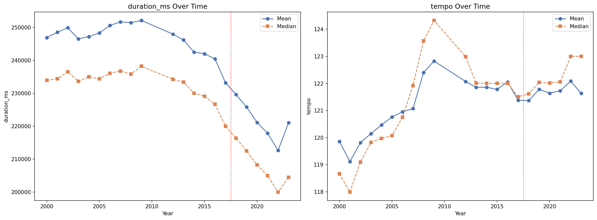
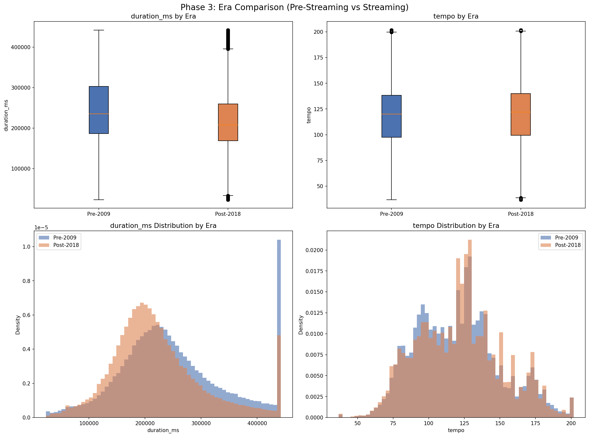
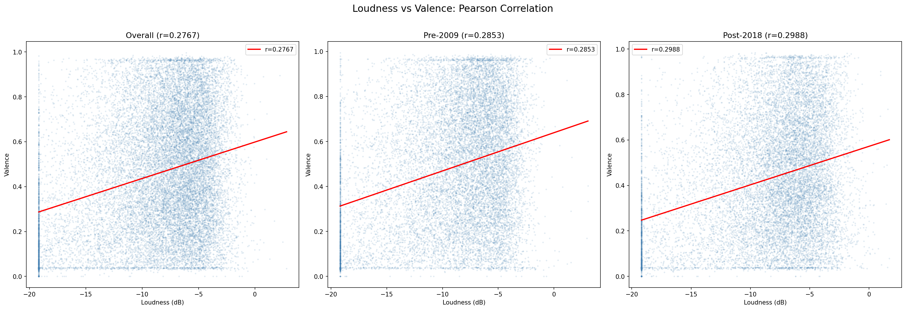
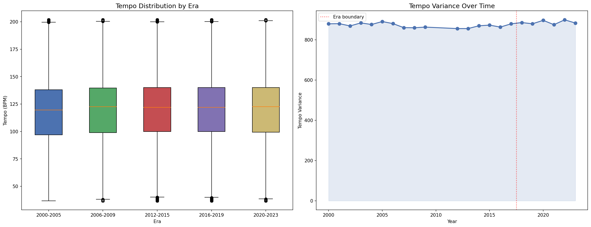
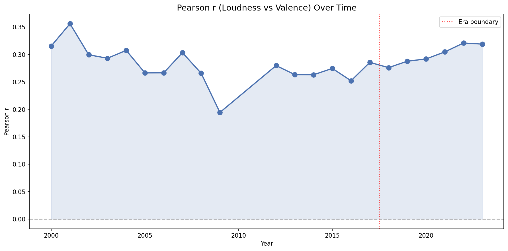

<p align="center">
  
</p>

<h1 align="center">Did Streaming Break How Songs Are Built?</h1>

<p align="center">
  <strong>A Multi-Method Statistical Analysis of 1M+ Spotify Tracks (2000 -- 2023)</strong>
</p>

<p align="center">
  <code>Welch's t-test</code> &nbsp;&middot;&nbsp;
  <code>Pearson's Correlation</code> &nbsp;&middot;&nbsp;
  <code>Levene's Variance Test</code> &nbsp;&middot;&nbsp;
  <code>Cohen's d</code> &nbsp;&middot;&nbsp;
  <code>Fisher Z-transform</code>
</p>

---

## Overview

The shift from physical media to algorithmic streaming reshaped the economics of music. Artists now earn revenue per play, not per minute. Playlist algorithms curate discovery. Short-form platforms reward instant hooks.

**Did these incentives measurably change how songs are composed?**

This project tests that question using a dataset of **1,048,575 Spotify tracks** spanning **82 genres** and **22 years**, applying inferential statistics covered in an introductory data analytics course.

---

## Key Findings

| Hypothesis | Method | Verdict | Result |
|:-----------|:-------|:--------|:-------|
| Songs are shorter post-2018 | Welch's t-test | **Supported** | -28 sec (-11.2%), *d* = 0.315 |
| Songs are faster post-2018 | Welch's t-test | Negligible | +1 BPM, *d* = 0.034 |
| Louder tracks are less happy | Pearson's *r* | **Rejected** (reversed) | *r* = +0.277, louder = happier |
| Tempo is converging | Levene's test | **Rejected** | U-shaped variance, highest in 2020-23 |

**Bottom line:** Streaming shortened songs by ~28 seconds, but it hasn't made them faster, sadder, or more uniform in tempo. The industry trimmed the container -- not the music inside it.

---

## Research Architecture

```
                     Main Question
          Did streaming change song structure?
               (Welch's t-test on duration & tempo)
                    /              \
                   /                \
          Branch 1                  Branch 2
   Loudness-Valence             Tempo Convergence
   Trade-off                    Across Eras
   (Pearson's r)                (Levene's test)
                    \              /
                     \            /
                  Unified Conclusion
           Has streaming homogenized music?
```

---

## Visualizations

<table>
  <tr>
    <td><br/><sub>Duration & tempo: pre-streaming vs streaming era</sub></td>
    <td><br/><sub>Loudness vs valence: positive, not negative</sub></td>
  </tr>
  <tr>
    <td><br/><sub>Tempo variance: U-shaped, not converging</sub></td>
    <td><br/><sub>Loudness-valence coupling strengthening over time</sub></td>
  </tr>
</table>

---

## Dataset

| Property | Value |
|:---------|:------|
| Source | Spotify Audio Features API |
| Tracks | 1,048,575 |
| Years | 2000--2009, 2012--2023 |
| Genres | 82 |
| Variables | 19 (popularity, danceability, energy, loudness, valence, tempo, duration, etc.) |
| Missing values | 0 |
| Duplicates | 0 |

**Era groupings used in analysis:**

| Group | Years | n |
|:------|:------|--:|
| Pre-streaming | 2000--2009 | 425,924 |
| Transition | 2012--2017 | 309,313 |
| Streaming era | 2018--2023 | 313,338 |

---

## Methods & Statistical Pipeline

### Preprocessing
1. **Missing value check** -- none found, no imputation needed
2. **Outlier detection** -- IQR method with winsorization (capping, not removal)
3. **Z-score standardization** -- for correlation analysis variables

### Inferential Analysis
- **Shapiro-Wilk** and **Kolmogorov-Smirnov** tests for normality (on n=5,000 subsamples)
- **Levene's test** for homoscedasticity
- **Welch's t-test** (independent, unequal variances) for era comparison
- **Cohen's d** for practical effect size
- **Pearson's r** for loudness-valence relationship
- **Fisher Z-transformation** to compare correlations across eras
- **Spearman's rho** for tempo variance trend over time

---

## Repository Structure

```
.
├── README.md                        # This file
├── research_findings.md             # Full research report (Introduction, Method, Results, Discussion)
├── final_analysis.ipynb             # Jupyter notebook with all runnable Python code
├── final_presentation.key           # Keynote slide deck (26 slides, dark theme)
├── spotify_data_edited.csv.gz       # Dataset (1M+ tracks, gzip compressed)
└── figures/
    ├── phase1_initial_distributions.png
    ├── phase2_before_after_boxplots.png
    ├── phase3_era_comparison.png
    ├── phase3_yearly_trends.png
    ├── phase4_loudness_valence_scatter.png
    ├── phase4_yearly_correlation_trend.png
    ├── phase5_tempo_convergence.png
    └── phase5_variance_bars.png
```

---

## How to Reproduce

```bash
# Clone the repo
git clone https://github.com/yarorazum/Did-Streaming-Break-How-Songs-Are-Built-.git
cd Did-Streaming-Break-How-Songs-Are-Built-

# Decompress the dataset
gunzip -k spotify_data_edited.csv.gz

# Install dependencies
pip install pandas numpy scipy matplotlib seaborn

# Run the analysis
jupyter notebook final_analysis.ipynb
```

The dataset is provided as a gzip archive (`spotify_data_edited.csv.gz`, ~69 MB). Decompress it before running the notebook. The notebook loads `spotify_data_edited.csv` and reproduces every figure and statistical test from scratch.

---

## Tech Stack

| Tool | Purpose |
|:-----|:--------|
| Python 3.10 | Core language |
| pandas | Data loading, manipulation, grouping |
| NumPy | Numerical operations |
| SciPy | Statistical tests (t-test, Pearson, Shapiro-Wilk, Levene) |
| Matplotlib | Plotting (histograms, scatter, line charts) |
| seaborn | Styled visualizations |
| Jupyter | Interactive analysis notebook |

---

## What I Learned

- **Statistical significance is not practical significance.** With 1M data points, a 1 BPM difference yields *p* < 0.001 -- but Cohen's *d* = 0.034 reveals it's meaningless.
- **Hypotheses can be wrong -- and that's the point.** The loudness-valence correlation ran opposite to our prediction, leading to a richer discussion about confounding variables (energy as a common cause).
- **Preprocessing choices matter.** Winsorization vs. removal produces different downstream results; documenting before/after stats is essential for transparency.
- **Effect sizes belong next to every p-value.** They anchor statistical results in the real world.

---

<p align="center">
  <sub>Built as the final project for DS108: Introduction to Data Analysis with Python</sub>
</p>
